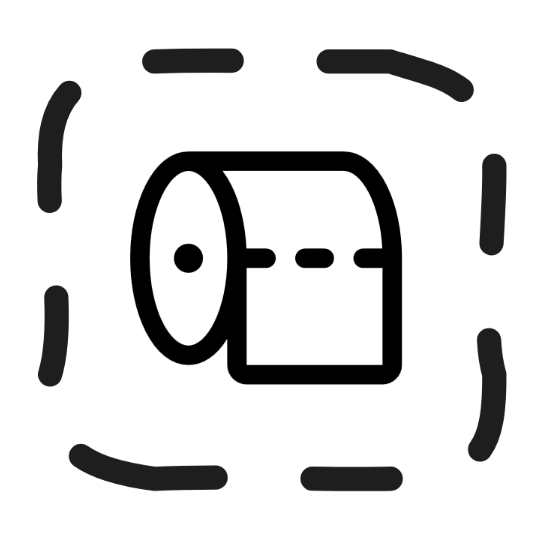

<div align="center">
  
  <br />
  <h1>Open-Lavatory</h1>
  <p><strong>Secure peer-to-peer JSON-RPC connectivity between dApps and wallets</strong></p>
  
  <div align="center">
    <a href="https://hackathon.web3privacy.info">
      
    </a>
    <a href="#">
      
    </a>
  </div>
</div>

---

## 🌟 Overview

> [!NOTE]  
> This project was built during 48 hours at [W3PN Hacks 2025](https://hackathon.web3privacy.info) in Berlin.
> It is to be treated as a proof of concept.

A secure privacy-first protocol for establishing peer-to-peer JSON-RPC connectivity between decentralized applications (dApps) and cryptocurrency wallets.

Open Lavatory Protocol eliminates centralized relay servers by enabling direct peer-to-peer connections between decentralized applications (dApps) and cryptocurrency wallets. Using public signaling servers for initial handshake and WebRTC combined with asymmetric encryption, it prioritizes **privacy** and **self-sovereignty**.

## 📦 Repository Structure

This repository includes the following packages:

| Package | Description |
|---------|-------------|
| 🔧 [lib](./packages/lib) | Core implementation of the OpenLV transport layer |
| 🔌 [connector](./packages/connector) | Wagmi connector for dApp integration |
| 🧪 [sandbox](./packages/sandbox) | Interactive testing environment with debug features |
| 👛 [wallet](./packages/wallet) | Sample wallet implementation for testing |
| 🌐 [dapp](./packages/dapp) | Wagmi-based dApp sandbox for end-to-end testing |

## 📋 Specification

> [!IMPORTANT]  
> This specification was written during a hackathon, it has its flaws, and should be treated as a proof of concept. Please see the [⚠️ Known Limitations](#-known-limitations) section for more details.

You can find the entire specification in [spec.md](./spec.md).

In short detail, the protocol works as follows:

1. **🔑 Key Generation**: Peer A (dApp) chooses a protocol, server, and generates a keypair
2. **📱 URL Sharing**: Connection details shared via QR code or copy/paste  
3. **🤝 Signaling**: Both peers connect to chosen signaling server (MQTT/Waku/Nostr)
4. **🔐 Handshake**: Hybrid encryption scheme securely exchanges keys
5. **🌐 WebRTC**: Asymmetric encryption negotiates direct P2P connection
6. **💬 Communication**: Encrypted JSON-RPC over local-preferred WebRTC

### ⚠️ Known Limitations

As always there is room for improvement;

The current specification implements a full homo-to-asymmetric encryption scheme, which could be simplified (taking signaling server race conditions into account) to be more efficient and only rely on asymmetric encryption.

In a similar manner, the `h` parameter specifies a hash of the public key, which allows for double verification when initiating a handshake during the signaling phase. This too could use improvements.

#### Browser support

- ✅ **Chromium-based browsers**: Full support with & w/out TURN servers
- ⚠️ **Firefox**: Requires TURN servers (potential centralization point)
- ❓ **Safari**: Limited testing

### 🔒 Security Features

- **🛡️ End-to-End Encryption**: ECDH P-256 + AES-256-GCM
- **🚫 No Central Authority**: Direct peer-to-peer communication
- **🔄 Fallback Mechanism**: MQTT reopens on WebRTC failure
- **✅ Key Verification**: SHA-256 public key hashing

## 🛠️ Getting Started

There are several ways to run this project

### Option 1: Sandbox + Sandbox

To test out the openlv transport layer, you can run the sandbox and the wallet in two separate tabs. The sandbox includes debug logs, extra features and fully fledged UI.

```bash
pnpm sandbox
```

And then open [localhost:5173](http://localhost:5173) in two of your browser tabs.

### Option 2: dApp + Sandbox

To test out the wagmi connector and explore the active connection you can initiate a session from the dApp sandbox.

The dApp sandbox aims to implement your average dApp, it includes basic wagmi UI, wrapper, and multi injected provider discovery.

```bash
pnpm dapp
pnpm sandbox
```

And then open [localhost:5173](http://localhost:5173) & [localhost:5174](http://localhost:5174) in your browser.

### Option 3: dApp + Wallet

We have also written a sample wallet implementation that would emulate how a wallet would implement the openlv transport layer.

You can run this in conjunction with the dApp or the sandbox.

```bash
pnpm wallet
pnpm dapp
```

And then open [localhost:5173](http://localhost:5173) & [localhost:5174](http://localhost:5174) in your browser.

## 🤝 Contributing

Built with ❤️ during a 48-hour hackathon. Contributions welcome!

## 👥 Attribution

**Builders**: [@talentlessguy](https://github.com/talentlessguy) & [@lucemans](https://github.com/lucemans)  
**Event**: [W3PN Hacks 2025](https://hackathon.web3privacy.info) in Berlin

---

<div align="center">
  <sub>🔒 Privacy-first • 🌐 Peer-to-peer • 🚀 Built for Web3</sub>
</div>
