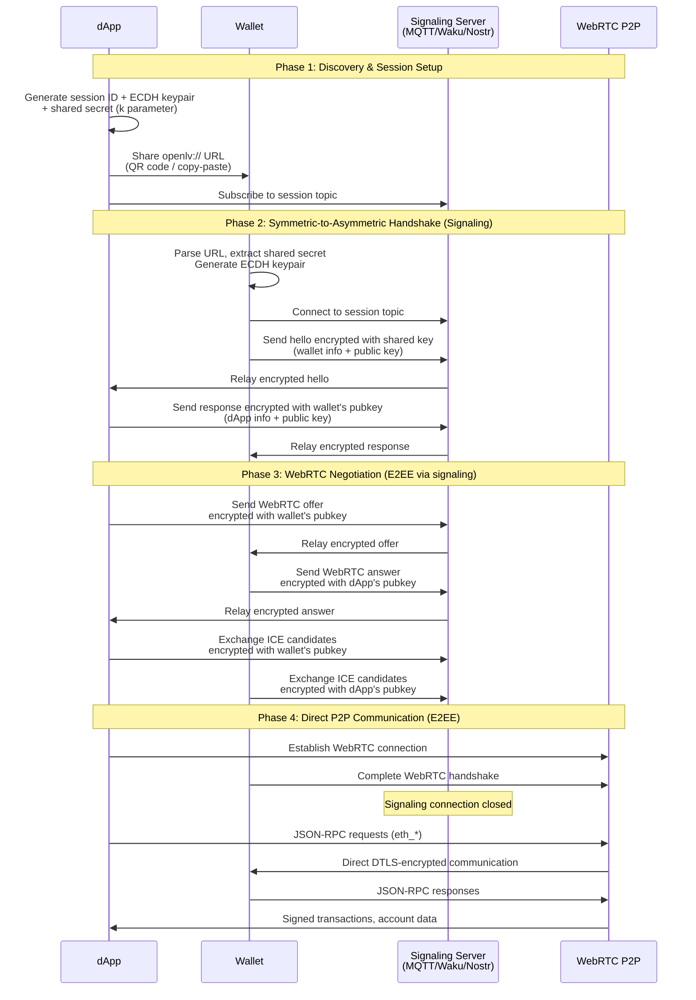

# Open Lavatory Protocol Specification v1.0

## Abstract

Open Lavatory is a secure privacy-first protocol for establishing peer-to-peer JSON-RPC connectivity between decentralized applications (dApps) and cryptocurrency wallets.
It serves as a drop-in replacement for WalletConnect, addressing the centralization issues introduced in WalletConnect v2 while maintaining compatibility with existing wallet standards such as [EIP-6963](https://eips.ethereum.org/EIPS/eip-6963) & [EIP-1193](https://eips.ethereum.org/EIPS/eip-1193).

## Motivation

[EIP-1328](https://eips.ethereum.org/EIPS/eip-1328) introduced the original wallet connection url specification. The goal simple; connect dApp & wallet via a relay server, or so called `bridge`.
This allowed for dApps to specify their own relay server, or allow users to specify their own via UI (although rarely implemented).

With the rollout of WalletConnect v2 (and thereby hostile deprecation of v1), the ability to specify a relay was removed, the v1 specifications (other then the EIP) erased, and the v2 spec no longer mentions such `bridge` parameter. Even through a rebrand, WCv2, now `@reown/appkit`, still mandates a central hardcoded relay server.

It has become clear that in the current Ethereum ecosystem, `@reown/appkit` has an undefeated monopoly.
Most dApps come pre-packaged with wagmi (and thereby `@reown/appkit`) and due to slight (mis-)use of javascript side-effects instantly loads its metrics, components, and other dependencies **on page load**.

The need for secure, private, local-first dApp-wallet connectivity is imminent.
This is where Open Lavatory comes in.

## 1. Introduction

### 1.1 Background

**WalletConnect v1** succeeded in providing a **dapp-decides-relay** solution for dApp-wallet communication, but WalletConnect v2 introduced significant centralization through a required relay server system.
Open Lavatory aims to address these issues using public signaling & existing p2p standards while improving security and privacy.

### 1.2 Design Goals

- **Peer-to-Peer**: Reliant on existing WebRTC & p2p standards
- **Privacy**: End-to-end encryption with only encrypted pairing data passing through signaling servers
- **Security**: Strong cryptographic protection and secure key exchange
- **Compatibility**: Drop-in replacement for existing wallet infrastructure via multi-injected provider discovery
- **Flexibility**: Support for multiple pairing server protocols (MQTT, Waku, Nostr, etc.)

## 2. URL Format Specification

### 2.1 Standard Format

```
openlv://<session-id>?h=<pubkey-hash>&k=<shared-key>&s=<pairing-server>&p=<protocol-type>
```

### 2.2 Parameters

| Parameter | Required | Description | Format |
|-----------|----------|-------------|---------|
| `session-id` | Yes | Unique session identifier | 16-character URL-safe random string (A-Z, a-z, 0-9, -, _) |
| `h` | Yes | Hash of dApp's public key for verification | First 8 bytes of SHA-256 hash, hex-encoded (16 characters) |
| `k` | Yes | Shared secret for symmetric encryption during handshake | 32 bytes, hex-encoded (64 characters) |
| `s` | No | Pairing server URL | URL-encoded string |
| `p` | No | Pairing server protocol | `mqtt`, `waku`, `nostr` |

### 2.3 Session ID Generation

Session IDs are generated using a cryptographically secure random number generator from the URL-safe alphabet:
- **Alphabet**: `ABCDEFGHIJKLMNOPQRSTUVWXYZabcdefghijklmnopqrstuvwxyz0123456789-_`
- **Length**: 16 characters
- **Entropy**: ~95.4 bits (64^16 possible combinations)
- **Collision Probability**: Negligible for practical purposes

### 2.4 Examples

```
openlv://k7n8m9x2w5q1p3r6?h=a1b2c3d4e5f60708&k=0123456789abcdef0123456789abcdef&p=mqtt&s=wss%3A//test.mosquitto.org%3A8081/mqtt

openlv://j9x7z4m2n8q5w3e1?h=f1e2d3c4b5a69708&k=fedcba9876543210fedcba9876543210f
```

### 2.5 Default Values

- `server`: `wss://test.mosquitto.org:8081/mqtt` (fallback MQTT broker)
- `protocol`: `mqtt`

## 3. Protocol Architecture

### 3.1 Overview

Open Lavatory establishes connections through a three-phase process:

1. **Discovery Phase**: dApp generates session credentials and presents connection URL
2. **Pairing Phase**: Wallet connects via public pairing server with encrypted communication
3. **Direct Connection Phase**: Peers establish WebRTC connection for ongoing communication

### 3.2 Connection Flow Diagram



### 3.3 Components

- **dApp (Peer A)**: Web application requesting wallet connection
- **Wallet (Peer B)**: Mobile or desktop wallet application
- **Pairing Server**: Public, protocol-agnostic message relay (MQTT, Waku, Nostr, etc.)
- **Provider Interface**: EIP-6963 compatible provider for dApp integration

## 4. Cryptographic Specification

### 4.1 Key Generation

Each peer generates an ECDH keypair using the P-256 (secp256r1) curve:
- **Algorithm**: ECDH (Elliptic Curve Diffie-Hellman)
- **Curve**: P-256 (secp256r1)
- **Public Key Format**: Uncompressed (65 bytes: 0x04 || x || y)
- **Private Key**: 32 bytes

### 4.2 Symmetric Encryption Handshake with pre-shared key

The `k` parameter provides a shared secret for initial handshake encryption:
- **Key Derivation**: HKDF-SHA256 from shared secret
- **Encryption**: AES-256-GCM with shared key
- **Purpose**: Encrypts initial pairing messages before ECDH key exchange

### 4.3 Public Key Hash

The public key hash included in the URL is computed as:
- **Hash Algorithm**: SHA-256
- **Truncation**: First 8 bytes of the hash
- **Encoding**: Hexadecimal (lowercase)

### 4.4 Message Encryption

Messages are encrypted using ECIES (Elliptic Curve Integrated Encryption Scheme):
- **Key Exchange**: ECDH with P-256
- **KDF**: HKDF-SHA256
- **Encryption**: AES-256-GCM
- **IV Size**: 96 bits (randomly generated per message)
- **Tag Size**: 128 bits

### 4.5 Message Format

Encrypted messages are base64-encoded with the following structure:
```
base64(ephemeral_pubkey || iv || encrypted_data || auth_tag)
```

Where:
- `ephemeral_pubkey`: 65 bytes (sender's ephemeral public key)
- `iv`: 12 bytes (random initialization vector)
- `encrypted_data`: Variable length encrypted payload
- `auth_tag`: 16 bytes (GCM authentication tag)

## 5. Pairing Server Protocols

### 5.1 MQTT Protocol

- **Topic Format**: `/openlv/session/<session-id>`
- **QoS Level**: 1 (at least once delivery)
- **Retain**: False
- **Clean Session**: True

### 5.2 Waku Protocol (Future)

- **Content Topic**: `/openlv/1/session/<session-id>/proto`
- **Ephemeral**: True
- **Store**: False

### 5.3 Nostr Protocol (Future)

- **Event Kind**: 21000 (ephemeral)
- **Tags**: `["t", "openlv-<session-id>"]`

## 6. Message Types

### 6.1 Public Key Advertisement

Sent by dApp to publish its public key:

```json
{
  "type": "pubkey",
  "payload": {
    "publicKey": "BHq8D7fX...", // Base64-encoded uncompressed P-256 public key
    "dAppInfo": {
      "name": "Example dApp",
      "url": "https://example.com",
      "icon": "data:image/svg+xml;base64,..."
    }
  },
  "sessionId": "k7n8m9x2w5q1p3r6",
  "timestamp": 1640995200
}
```

### 6.2 Hello Message

Sent by wallet to initiate connection (encrypted with shared key from URL):

```json
{
  "type": "hello",
  "payload": {
    "publicKey": "BHq8D7fX...", // Base64-encoded wallet's public key
    "walletInfo": {
      "name": "Example Wallet",
      "version": "1.0.0",
      "icon": "data:image/svg+xml;base64,..."
    }
  },
  "sessionId": "k7n8m9x2w5q1p3r6",
  "timestamp": 1640995200
}
```

### 6.3 WebRTC Offer/Answer

Standard WebRTC SDP exchange (encrypted with recipient's public key):

```json
{
  "type": "webrtc-offer",
  "payload": {
    "type": "offer",
    "sdp": "v=0\r\no=- 123456 123456 IN IP4 0.0.0.0\r\n..."
  },
  "sessionId": "k7n8m9x2w5q1p3r6",
  "timestamp": 1640995200
}
```

### 6.4 ICE Candidates

WebRTC ICE candidate exchange (encrypted with recipient's public key):

```json
{
  "type": "ice-candidate",
  "payload": {
    "candidate": "candidate:1 1 UDP 2013266431 192.168.1.100 54400 typ host",
    "sdpMid": "0",
    "sdpMLineIndex": 0
  },
  "sessionId": "k7n8m9x2w5q1p3r6",
  "timestamp": 1640995200
}
```

## 7. WebRTC Configuration

### 7.1 ICE Servers

Default STUN/TURN servers for maximum compatibility:

```javascript
{
  iceServers: [
    // STUN servers
    { urls: 'stun:stun.l.google.com:19302' },
    { urls: 'stun:stun.services.mozilla.com:3478' },

    // TURN servers (OpenRelay)
    {
      urls: ['turn:openrelay.metered.ca:80', 'turn:openrelay.metered.ca:443'],
      username: 'openrelayproject',
      credential: 'openrelayproject'
    }
  ],
  iceCandidatePoolSize: 10,
  iceTransportPolicy: 'all',
  bundlePolicy: 'max-bundle',
  rtcpMuxPolicy: 'require'
}
```

### 7.2 Browser Support

Chromium-based browsers work well with STUN servers, while Firefox requires TURN servers for reliable WebRTC connections.
