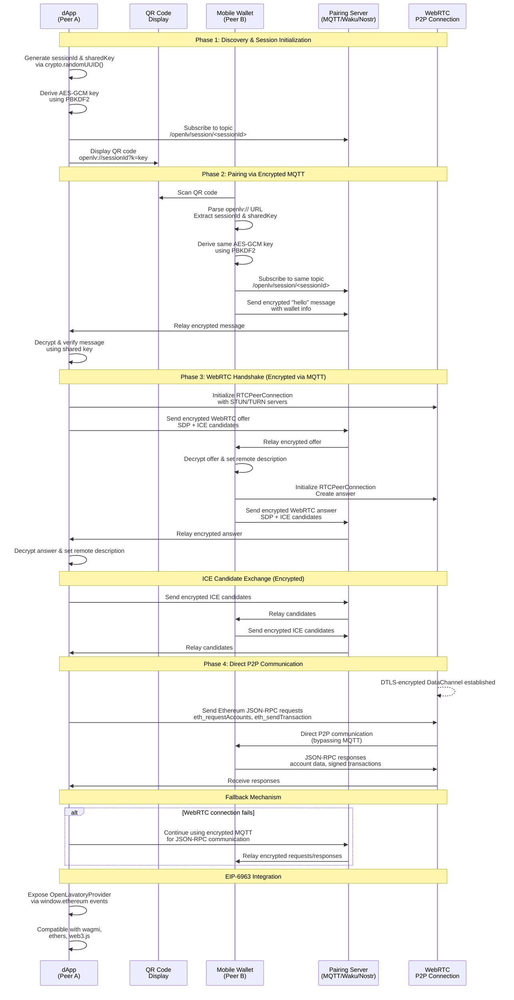

# Open Lavatory Protocol Specification v1.0

## Abstract

Open Lavatory is a decentralized, privacy-first protocol for establishing secure peer-to-peer connections between decentralized applications (dApps) and cryptocurrency wallets.
It serves as a drop-in replacement for WalletConnect, addressing the centralization issues introduced in WalletConnect v2 while maintaining compatibility with existing wallet standards such as [EIP-6963](https://eips.ethereum.org/EIPS/eip-6963) & [EIP-1193](https://eips.ethereum.org/EIPS/eip-1193).

## 1. Introduction

### 1.1 Background

**WalletConnect v1** succeeded in providing a **dapp-decides-relay** solution for dApp-wallet communication, but WalletConnect v2 introduced significant centralization through a required relay server system.
Open Lavatory aims to address these issues using public signaling & existing p2p standards while improving security and privacy.

### 1.2 Design Goals

- **Peer-to-Peer**: Reliant on existing WebRTC & p2p standards
- **Privacy**: End-to-end encryption with only encrypted pairing data passing through signaling servers
- **Security**: Strong cryptographic protection and secure key exchange
- **Compatibility**: Drop-in replacement for existing wallet infrastructure via multi-injected provider discovery
- **Flexibility**: Support for multiple pairing server protocols (MQTT, Waku, Nostr, etc.)

## 2. Protocol Architecture

### 2.1 Overview

Open Lavatory establishes connections through a three-phase process:

1. **Discovery Phase**: dApp generates session credentials and presents connection URL
2. **Pairing Phase**: Wallet connects via public pairing server with encrypted communication
3. **Direct Connection Phase**: Peers establish WebRTC connection for ongoing communication

### 2.2 Connection Flow Diagram

The following diagram illustrates the complete connection establishment process:



### 2.3 Components

- **dApp (Peer A)**: Web application requesting wallet connection
- **Wallet (Peer B)**: Mobile or desktop wallet application
- **Pairing Server**: Public, protocol-agnostic message relay (MQTT, Waku, Nostr, etc.)
- **Provider Interface**: EIP-6963 compatible provider for dApp integration

## 3. URL Format Specification

### 3.1 Standard Format

```
openlv://<session-id>?k=<shared-key>&s=<pairing-server>&p=<protocol-type>
```

### 3.2 Parameters

| Parameter | Required | Description | Format |
|-----------|----------|-------------|---------|
| `session-id` | Yes | Unique session identifier | UUID v4 |
| `k` | Yes | Pre-shared encryption key | Base64-encoded 256-bit key |
| `s` | No | Pairing server URL | URL-encoded string |
| `p` | No | Pairing server protocol | `mqtt`, `waku`, `nostr` |

### 3.3 Examples

```
openlv://550e8400-e29b-41d4-a716-446655440000?k=YWJjZGVmZ2hpams&s=wss%3A//test.mosquitto.org%3A8081/mqtt&p=mqtt

openlv://550e8400-e29b-41d4-a716-446655440000?k=YWJjZGVmZ2hpams
```

### 3.4 Default Values

- `server`: `wss://test.mosquitto.org:8081/mqtt` (fallback MQTT broker)
- `protocol`: `mqtt`

## 4. Cryptographic Specification

### 4.1 Key Derivation

Shared keys are derived using PBKDF2 with the following parameters:
- **Algorithm**: PBKDF2
- **Hash**: SHA-256
- **Iterations**: 100,000
- **Salt**: `openlv-salt` (UTF-8 encoded)
- **Output**: 256-bit AES-GCM key

### 4.2 Message Encryption

All messages transmitted via pairing servers are encrypted using:
- **Algorithm**: AES-GCM
- **Key Size**: 256 bits
- **IV Size**: 96 bits (randomly generated per message)
- **Tag Size**: 128 bits

### 4.3 Message Format

Encrypted messages are base64-encoded with the following structure:
```
base64(iv || encrypted_data || auth_tag)
```

## 5. Pairing Server Protocols

### 5.1 MQTT Protocol

- **Topic Format**: `/openlv/session/<session-id>`
- **QoS Level**: 1 (at least once delivery)
- **Retain**: False
- **Clean Session**: True

### 5.2 Waku Protocol (Future)

- **Content Topic**: `/openlv/1/session/<session-id>/proto`
- **Ephemeral**: True
- **Store**: False

### 5.3 Nostr Protocol (Future)

- **Event Kind**: 21000 (ephemeral)
- **Tags**: `["t", "openlv-<session-id>"]`

## 6. Message Types

### 6.1 Hello Message

Sent by wallet to initiate connection:

```json
{
  "type": "hello",
  "payload": {
    "walletInfo": {
      "name": "Example Wallet",
      "version": "1.0.0",
      "icon": "data:image/svg+xml;base64,..."
    }
  },
  "sessionId": "550e8400-e29b-41d4-a716-446655440000",
  "sharedKey": "pre-shared-key",
  "timestamp": 1640995200
}
```

### 6.2 WebRTC Offer/Answer

Standard WebRTC SDP exchange:

```json
{
  "type": "webrtc-offer",
  "payload": {
    "type": "offer",
    "sdp": "v=0\r\no=- 123456 123456 IN IP4 0.0.0.0\r\n..."
  },
  "sessionId": "550e8400-e29b-41d4-a716-446655440000",
  "sharedKey": "pre-shared-key",
  "timestamp": 1640995200
}
```

### 6.3 ICE Candidates

WebRTC ICE candidate exchange:

```json
{
  "type": "ice-candidate",
  "payload": {
    "candidate": "candidate:1 1 UDP 2013266431 192.168.1.100 54400 typ host",
    "sdpMid": "0",
    "sdpMLineIndex": 0
  },
  "sessionId": "550e8400-e29b-41d4-a716-446655440000",
  "sharedKey": "pre-shared-key",
  "timestamp": 1640995200
}
```

## 7. WebRTC Configuration

### 7.1 ICE Servers

Default STUN/TURN servers for maximum compatibility:

```javascript
{
  iceServers: [
    // STUN servers
    { urls: 'stun:stun.l.google.com:19302' },
    { urls: 'stun:stun.services.mozilla.com:3478' },
    
    // TURN servers (OpenRelay)
    {
      urls: ['turn:openrelay.metered.ca:80', 'turn:openrelay.metered.ca:443'],
      username: 'openrelayproject',
      credential: 'openrelayproject'
    }
  ],
  iceCandidatePoolSize: 10,
  iceTransportPolicy: 'all',
  bundlePolicy: 'max-bundle',
  rtcpMuxPolicy: 'require'
}
```

### 7.2 Data Channel

- **Label**: `openlv-data`
- **Ordered**: True
- **Max Retransmits**: 3

## 8. EIP-6963 Provider Integration

### 8.1 Provider Discovery

The dApp side implements EIP-6963 Multi Injected Provider Discovery:

```javascript
interface EIP6963ProviderInfo {
  uuid: string;
  name: string;
  icon: string;
  rdns: string;
}

interface EIP6963ProviderDetail {
  info: EIP6963ProviderInfo;
  provider: EthereumProvider;
}
```

### 8.2 Open Lavatory Provider

```javascript
const openLavatoryProvider = {
  info: {
    uuid: "org.openlavatory.provider",
    name: "Open Lavatory",
    icon: "data:image/svg+xml;base64,...",
    rdns: "org.openlavatory"
  },
  provider: new OpenLavatoryEthereumProvider()
};
```

### 8.3 Provider Methods

The provider implements standard Ethereum provider methods:
- `eth_requestAccounts`
- `eth_accounts`
- `eth_sendTransaction`
- `eth_signTransaction`
- `personal_sign`
- `eth_signTypedData_v4`

## 9. Security Considerations

### 9.1 Key Generation

- Session IDs and shared keys MUST use cryptographically secure random number generation
- Keys MUST be generated with sufficient entropy (minimum 256 bits)
- Keys MUST be unique per session

### 9.2 Message Authentication

- All messages MUST include timestamp to prevent replay attacks
- Messages older than 5 minutes SHOULD be rejected
- Shared key verification MUST be performed on all received messages

### 9.3 Connection Security

- WebRTC connections MUST use DTLS encryption
- Pairing server communications MUST be encrypted end-to-end
- No plaintext sensitive data SHOULD be transmitted

### 9.4 Privacy Protection

- Session metadata MUST NOT be logged by pairing servers
- Connection attempts SHOULD use different session IDs for each attempt
- WebRTC connections SHOULD prefer direct peer-to-peer paths

## 10. Implementation Guidelines

### 10.1 dApp Integration

1. Implement EIP-6963 provider discovery
2. Generate session credentials on connection request
3. Display QR code with Open Lavatory URL
4. Handle WebRTC connection establishment
5. Proxy Ethereum JSON-RPC calls over established connection

### 10.2 Wallet Integration

1. Implement QR code scanning for `openlv://` URLs
2. Parse connection parameters and validate format
3. Establish encrypted pairing server connection
4. Complete WebRTC handshake process
5. Implement Ethereum JSON-RPC request handling

### 10.3 Error Handling

- Connection timeouts: 30 seconds for initial pairing, 15 seconds for WebRTC
- Retry logic: Exponential backoff with maximum 5 attempts
- Graceful degradation: Fall back to pairing server if WebRTC fails

## 11. Compatibility

### 11.1 WalletConnect Migration

Open Lavatory can serve as a drop-in replacement for WalletConnect with:
- Similar connection flow and UX
- Compatible provider interface
- Standard Ethereum JSON-RPC methods
- Session management concepts

### 11.2 Browser Support

- Chrome/Chromium 88+
- Firefox 78+
- Safari 14+
- Mobile browsers with WebRTC support

## 12. Future Extensions

### 12.1 Multi-Chain Support

- Chain-specific session parameters
- Cross-chain transaction coordination
- Chain switching notifications

### 12.2 Advanced Pairing Servers

- Waku v2 integration for censorship resistance
- Nostr relay support for decentralized messaging
- Custom relay protocols for specialized use cases

### 12.3 Enhanced Security

- Forward secrecy with key rotation
- Multi-device session management
- Hardware security module integration

## 13. Reference Implementation

Reference implementations are available in the `/packages/lib` directory, including:
- JavaScript/TypeScript library for dApps and wallets
- EIP-6963 provider implementation
- Example integrations for popular wallet frameworks

---

*This specification is versioned and may be updated. Implementations should specify which version they support.*
